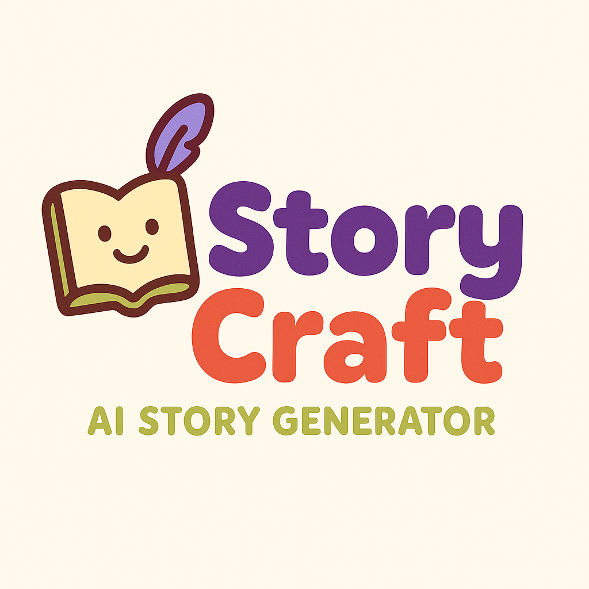

# StoryCraft Backend

<p align="center">
  
</p>

A powerful backend service for generating personalized children's stories with AI, complete with illustrations and audio narration.

## ✨ Features

- **👤 User Authentication**: Secure registration, login, and token management
- **📚 Story Generation**: Create customized stories based on age range and character inputs
- **🎨 Illustrations**: Generate AI-powered illustrations for stories
- **🔊 Audio Narration**: Convert stories to speech for an immersive experience
- **🔄 RESTful API**: Well-documented endpoints with Swagger
- **🛡️ Secure**: JWT-based authentication with refresh token rotation

## 🚀 Tech Stack

- **Framework**: Express.js with TypeScript
- **Database**: PostgreSQL with Prisma ORM
- **Authentication**: JWT, bcrypt
- **Cloud Storage**: AWS S3 for illustrations and audio
- **AI Integration**: OpenAI for story generation and illustrations
- **Documentation**: Swagger/OpenAPI

## 📋 Prerequisites

- Node.js (v14+)
- PostgreSQL
- AWS Account (for S3 storage)
- OpenAI API Key

## ⚙️ Installation

1. **Clone the repository**

   ```bash
   git clone https://github.com/yourusername/ai-story-backend.git
   cd ai-story-backend
   ```

2. **Install dependencies**

   ```bash
   npm install
   ```

3. **Set up environment variables**
   Create a `.env` file in the root directory with the following variables:

   ```
   DATABASE_URL=""
   PORT=8888
   JWT_ACCESS_SECRET=your_access_secret
   JWT_REFRESH_SECRET=your_refresh_secret
   OPENAI_API_KEY=your_openai_api_key
   AWS_ACCESS_KEY_ID=your_aws_access_key
   AWS_SECRET_ACCESS_KEY=your_aws_secret_key
   AWS_REGION=your_aws_region
   AWS_S3_BUCKET=your_s3_bucket
   ```

4. **Set up the database and run migrations**

   ```bash
   npx prisma migrate dev
   ```

5. **Start the development server**
   ```bash
   npm run dev
   ```

## 🔗 API Endpoints

### Authentication

- `POST /auth/register` - Register a new user
- `POST /auth/login` - Log in a user
- `POST /auth/refresh-token` - Refresh access token
- `POST /auth/revoke-refresh-tokens` - Revoke refresh tokens

### Users

- `GET /users/me` - Get current user profile

### Stories

- `POST /stories` - Generate a new story
- `GET /stories` - Get all stories for current user
- `GET /stories/:id` - Get a specific story
- `DELETE /stories/:id` - Delete a story

### Illustrations

- `POST /illustrations` - Generate illustration for a story
- `GET /illustrations/:storyId` - Get illustrations for a story

## 🧪 Development

- **Build the application**

  ```bash
  npm run build
  ```

- **Run in production mode**
  ```bash
  npm start
  ```

## 📖 Documentation

API documentation is available at `/api-docs` when the server is running.

## 👥 Contributors

- Lucas Cardoso

---

Made with ❤️ by StoryCraft for young readers everywhere
